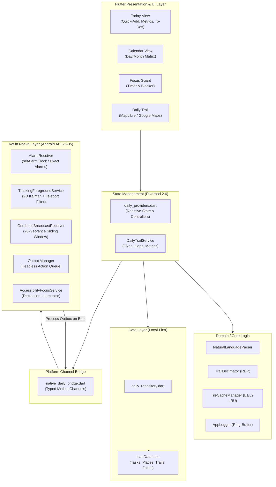

# Remember Me 🧭

<div align="center">

-3DDC84?style=for-the-badge&logo=android&logoColor=white)


<p align="center">
  <strong>A sovereign, local-first daily productivity and spatial awareness application.</strong><br>
  Rock-solid alarms, natural language task capture, distraction-free focus guarding, and battery-efficient daily movement trails with offline vector maps.<br>
  <em>No subscriptions. No cloud telemetry. No accounts required.</em>
</p>

[**Download Latest APK (v1.0.1)**](https://github.com/sharancode3/Remember-Me---Personal-Reminder-To-do-/releases/download/v1.0.1/Remember-Me.apk) • [**Architecture Records**](#-architecture-decision-records-adrs) • [**Feature Tour**](#-core-capabilities) • [**Build Guide**](#-building--verifying)

</div>

---

## 📖 Table of Contents

- [Overview](#-overview)
- [Quick Download & Installation](#-quick-download--installation)
- [Core Capabilities](#-core-capabilities)
- [System Architecture](#-system-architecture)
- [Directory Structure](#-directory-structure)
- [Technical Highlights & Engineering Deep Dives](#-technical-highlights--engineering-deep-dives)
- [Permissions & Privacy](#-permissions--privacy-model)
- [Building & Verifying](#-building--verifying)
- [Architecture Decision Records (ADRs)](#-architecture-decision-records-adrs)
- [License](#-license)

---

## 🔭 Overview

Most modern productivity tools suffer from cloud dependence, aggressive subscription models, battery drain, and unreliable reminder dispatch due to aggressive Android Doze and OEM background killing.

**Remember Me** is engineered as an industry-grade, local-first personal companion designed from the hardware up:
- **Never miss a deadline:** Hardware-backed exact alarms fire even in Doze mode or across device reboots.
- **Capture at the speed of thought:** Natural language parser translates freeform speech or text into scheduled reminders.
- **Stay in deep work:** Accessibility-powered focus blocker suppresses distractions while preserving critical safety tools.
- **Trace your daily steps:** Continuous, battery-aware dead-reckoning movement trail with 2D metric Kalman filtering and offline vector cartography.
- **100% Data Sovereignty:** Everything is stored locally on device via Isar Database. Zero telemetry, zero analytics, zero external API prerequisites.

---

## 📲 Quick Download & Installation

The production release is pre-compiled with full R8 code optimization, resource shrinking, and bytecode minification:

| Asset | Details | Direct Download |
| :--- | :--- | :--- |
| **`Remember-Me.apk`** | Universal Release (v1.0.1, ~37.5 MB) | [⬇️ Download Direct APK](https://github.com/sharancode3/Remember-Me---Personal-Reminder-To-do-/releases/download/v1.0.1/Remember-Me.apk) |

> [!TIP]
> **Installation on Android:**  
> 1. Download `Remember-Me.apk` to your Android device.  
> 2. Tap the downloaded notification or open it via your Files app.  
> 3. If prompted, enable **"Allow from this source"** for your browser/file manager.  
> 4. Tap **Install** and launch Remember Me!

---

## ⚡ Core Capabilities

### 📅 1. Daily Planner & Natural Language Quick-Add
- **Fluid Task Capture:** Type naturally (e.g., `Submit report tomorrow 4pm #work !high`) to instantly populate dates, times, tags, and priorities.
- **Automated Rollover:** Incomplete tasks carry over gracefully past midnight without manual rescheduling.
- **Interactive Calendar:** Seamless day-by-day and month-by-month exploration with recurrence calculation.

### 🔔 2. Hardware-Reliable Reminders & Alarm Clock
- **Doze-Proof Dispatch:** Native Kotlin `AlarmManager` integration utilizing `setAlarmClock()` and `setExactAndAllowWhileIdle()` to ensure on-second arrival.
- **Versioned Audio Channels:** Immutable Android 8+ notification channels (`reminders_v2`, `reminders_alarm_v2`, `place_alerts_v2`, `trail_status`) configured with high importance and audio attributes.
- **Headless Outbox Pattern:** Notification quick actions (**"Done"** / **"Snooze 10m"**) persist directly to a disk-backed queue from native Kotlin without waking up the heavy Flutter engine.
- **Rolling Reconciler:** Maintains a sliding 14-day scheduling window ensuring recurrence calculation never overflows system alarm limits.

### 🗺️ 3. Ambient Daily Trail & Vector Maps
- **2D Metric Kalman Filtering:** Converts GPS coordinates to local ENU tangent plane metrics, eliminating urban multipath jitter and stationary drift (<12m std dev).
- **Metro & Tunnel Gap Detection:** Intelligently tags prolonged GPS loss (>120s or >180 km/h) as explicit `TrailGap` dashed paths rather than erroneous teleportation lines.
- **Dual Vector Map Stack:**
  - **OpenFreeMap Bright Vector Tiles:** Free, fast vector tiles via MapLibre GL with clean Google-like styling. No credit card, no billing account, and zero API costs.
  - **Optional Google Maps View:** Seamless toggle to render identical trails on native Google Maps SDK when an optional API key is configured.
- **Buttery 60–120 FPS Interaction:** Ramer-Douglas-Peucker (RDP) polyline decimation (`TrailDecimator`) and widget memoization compress vertices by 70–85% without geometric distortion.
- **Two-Tier LRU Tile Cache:** Bounded 64-tile memory cache (L1) and 150MB auto-pruned disk cache (L2) providing ambient offline coverage during commutes.

### 📍 4. Autonomous Geofencing & Place Linking
- **Sliding Geofence Window:** Dynamically registers up to 20 nearest places with Google Play Services `GeofencingClient` when continuous tracking is paused, automatically shifting the center upon moving >1km.
- **Anti-Bounce Hysteresis:** Enforces a 90-second arrival dwell and `radius + 50m` exit buffer to eliminate edge-boundary notification spam.
- **Place-Linked Tasks:** Links to-dos by place ID or `#tags`, alerting you with pending item counts the moment you arrive.

### 🎯 5. Focus Guard
- **Distraction Interception:** Non-intrusive AccessibilityService blocks pre-configured distracting apps during active focus sessions.
- **Emergency Safeguards:** Essential applications (Phone, Settings, Home Launcher) remain accessible at all times.
- **Crash-Resilient State:** Survives process death and calculates focused duration accurately across device reboots.

---

## 🏛️ System Architecture



---

## 📁 Directory Structure

```text
z7.Remember me-NIR/
├── android/
│   └── app/src/main/kotlin/com/example/remember_me/
│       ├── MainActivity.kt                # Platform channel registration & life-cycle
│       ├── AlarmReceiver.kt               # Exact alarm intent dispatcher & audio alerts
│       ├── TrackingService.kt             # High-precision 2D Kalman GPS tracking engine
│       ├── GeofenceReceiver.kt            # Google Play Services geofence transitions
│       ├── OutboxManager.kt               # Headless notification actions disk queue
│       └── AccessibilityFocusService.kt   # System window focus blocker & safety exceptions
├── lib/
│   ├── main.dart                          # Application entry point & crash reporting
│   └── src/
│       ├── app.dart                       # App root, multi-palette theming, orientation
│       ├── core/
│       │   ├── bootstrap/bootstrap.dart   # Isar DB & platform subsystem bootstrapper
│       │   ├── logging/app_logger.dart    # Size-capped diagnostic ring-buffer
│       │   ├── notifications/             # ReminderScheduler interface & unified implementation
│       │   ├── platform/                  # Typed NativeDailyBridge MethodChannels
│       │   ├── theme/daily_theme.dart     # Palette engine (Mint, Ocean, Rose)
│       │   └── utils/                     # NaturalLanguageParser, TrailDecimator, Date formatters
│       ├── data/
│       │   ├── local/isar_service.dart    # Isar lifecycle, schemas, migration handling
│       │   ├── models/                    # TaskModel, SavedPlaceModel, TrailFix, FocusSession
│       │   └── repositories/              # Repository interfaces & Isar implementations
│       ├── features/
│       │   ├── calendar/presentation/     # Calendar tab with date-strip and recurrence grid
│       │   ├── tasks/presentation/        # QuickAddBar, TaskRow, TaskEditorBottomSheet
│       │   ├── today/presentation/        # Today dashboard, completion rings, priority buckets
│       │   └── splash/presentation/       # EntranceReveal fluid physics splash
│       └── presentation/
│           ├── providers/daily_providers.dart # Riverpod state providers
│           └── screens/                   # DailyHomeScreen, DailyFocusScreen, DailyTrailScreen
├── test/                                  # 57+ unit and widget test specs
├── docs/
│   ├── AUDIT.md                           # Comprehensive production codebase audit
│   ├── API_SETUP.md                       # Free vector map & optional Google Maps config
│   └── adr/                               # Architecture Decision Records (001 to 008)
└── pubspec.yaml                           # Dependency definitions & asset configurations
```

---

## 🔬 Technical Highlights & Engineering Deep Dives

### 1. Headless Outbox Pattern
Notification actions (**"Done"** and **"Snooze"**) must execute immediately. Spawning the Flutter engine from a notification action costs 200–400 MB RAM and takes over 1.5 seconds.
- When an action is tapped, Kotlin's `NotificationReceiver` updates the system notification immediately and writes an atomic record to `remember_me_outbox.json`.
- When the user subsequently opens the Flutter app, `NativeDailyBridge.pollOutbox()` ingests the pending actions into the Isar database in a single transaction, achieving zero UI freeze and instantaneous user feedback.

### 2. 2D Metric Kalman Filter & Stationary Jitter Suppression
Standard GPS raw data reports substantial noise when stationary (GPS drift).
- Raw lat/lng fixes are projected onto a local tangent plane using an East-North-Up (ENU) Cartesian frame.
- A 4-state constant velocity Kalman filter tracks `[x, y, vx, vy]`.
- Fixes with velocities under 0.3 m/s and accuracy deviations under 12m are clamped, eliminating phantom mileage accumulation while sitting at a desk.
- Prolonged outages (e.g. subway tunnels) are preserved as `TrailGap` boundaries rather than interpolated nonsense.

### 3. High-Performance Polyline Decimation
Daily trails often accumulate 10,000+ coordinates per day. Rendering raw polylines directly stalls the Skia/Impeller Canvas thread.
- `TrailDecimator` applies the **Ramer-Douglas-Peucker (RDP)** algorithm (`epsilon = 2.0 meters`).
- Line segments and gap polylines are memoized (`_cachedSegments`, `_cachedGapPolylines`) and only recomputed when the underlying fix collection changes.
- Panning and zooming remain locked at 60–120 FPS.

### 4. Zero-Cost Free Vector Maps
- Standard map tiles require paid subscriptions or credit card billing accounts.
- Remember Me integrates **OpenFreeMap Bright** vector styles hosted over fast CDNs with zero billing requirements.
- Combined with a dual-tier LRU cache (64 tiles in RAM, 150 MB disk cache throttled to prune once every 50 writes), maps load instantly even when commuting offline.

---

## 🔒 Permissions & Privacy Model

Remember Me follows a strict **zero-trust, local-only** design:

| Permission | Purpose | User Guarantee |
| :--- | :--- | :--- |
| `POST_NOTIFICATIONS` | Time reminders and place arrival alerts. | Never used for ads or marketing. |
| `SCHEDULE_EXACT_ALARM` | Hardware precision for user-defined task alarms. | Scheduled within a safe 14-day rolling window. |
| `ACCESS_FINE_LOCATION` | Movement trail recording and place geofences. | Processed entirely on-device; never leaves your phone. |
| `FOREGROUND_SERVICE` | Keeps movement tracking alive during workouts or commutes. | Shows a persistent notification; stops instantly when toggled off. |
| `ACCESSIBILITY_SERVICE` | Detects app launches during Focus Mode to block distractions. | Strictly inspects package names; never captures text or screen contents. |

---

## 🛠️ Building & Verifying

### Prerequisites
- **Flutter SDK:** `^3.24.0` (Dart `^3.5.0`)
- **Android SDK:** API Level 26 (Android 8.0) to API Level 35 (Android 15)
- **JDK:** OpenJDK 17
- **Gradle:** 8.14

### Verification Commands
```powershell
# 1. Fetch dependencies
flutter pub get

# 2. Strict static analysis (Zero-warning policy)
flutter analyze

# 3. Run all Flutter unit & widget tests
flutter test

# 4. Run native Android JVM unit tests
cd android
.\gradlew.bat :app:testDebugUnitTest
cd ..
```

### Build Production Release APK
```powershell
flutter build apk --release --tree-shake-icons
```
Artifact generated: `build/app/outputs/flutter-apk/app-release.apk`

---

## 📑 Architecture Decision Records (ADRs)

All architectural shifts and trade-offs are strictly documented:

| ADR | Title | Decision Summary |
| :--- | :--- | :--- |
| [**001**](docs/adr/001-architecture-pruning.md) | Architecture Pruning & Hygiene | Pruned dormant Architecture A engines; locked project to Architecture B Daily App. |
| [**002**](docs/adr/002-persistence-strategy.md) | Persistence Strategy | Decoupled Isar 3.x behind repository interfaces for painless future Drift migration. |
| [**003**](docs/adr/003-notification-scheduler-outbox.md) | Unified Scheduler & Headless Outbox | Replaced divergent schedulers with single Kotlin `AlarmManager` and disk outbox. |
| [**003b**](docs/adr/003-trail-kalman-gaps.md) | Kalman Filter & GPS Gap Detection | Implemented local ENU 2D Kalman filter with tunnel gap detection and dead-reckoning. |
| [**004**](docs/adr/004-native-geofencing-places.md) | Native Geofencing & Place Linking | 20-geofence sliding window with 90s dwell and hysteresis filtering. |
| [**005**](docs/adr/005-map-stack.md) | Map Stack & Vector Tiles | MapLibre GL with OpenFreeMap Bright vector tiles + opt-in Google Maps SDK layer. |
| [**006**](docs/adr/006-feature-architecture.md) | Feature Modularization | Decoupled features with typed compile-time checked `NativeDailyBridge`. |
| [**007**](docs/adr/007-performance-ci.md) | Performance & Decimation | Integrated RDP polyline decimation and bounded LRU tile caching. |
| [**008**](docs/adr/008-final-polish.md) | Entrance Reveal & Polish | Added physics-based fluid entrance reveal and locked orientation. |

---

## 📄 License

Distributed under the **MIT License**. See `LICENSE` for more information.

---

<div align="center">
  <sub>Crafted with engineering discipline for private, intentional daily productivity.</sub>
</div>
