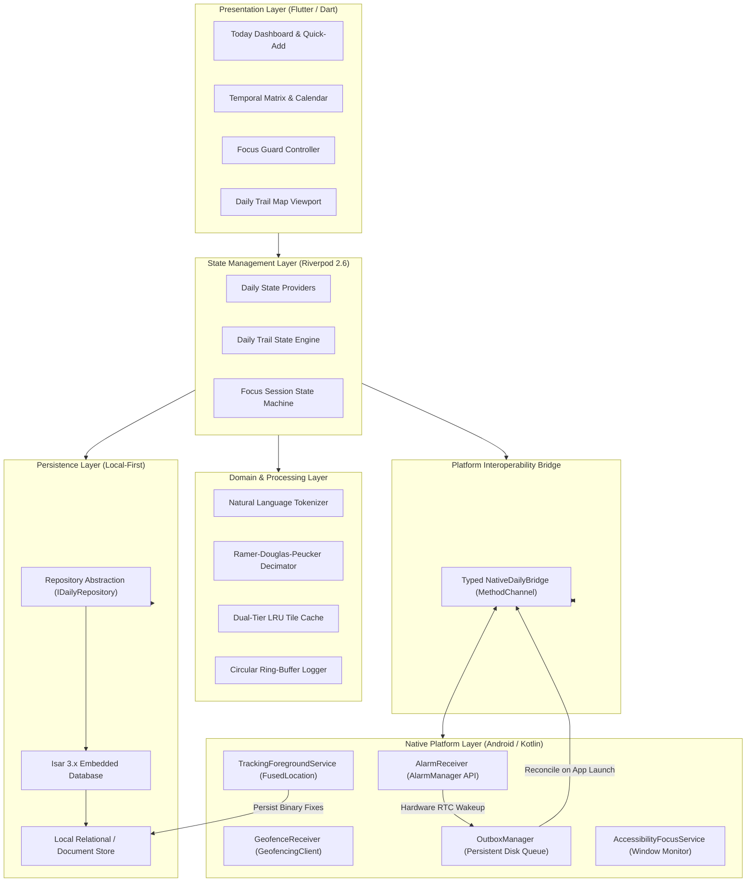
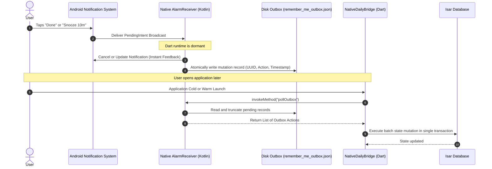
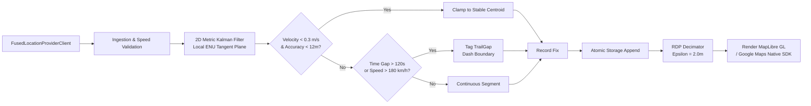
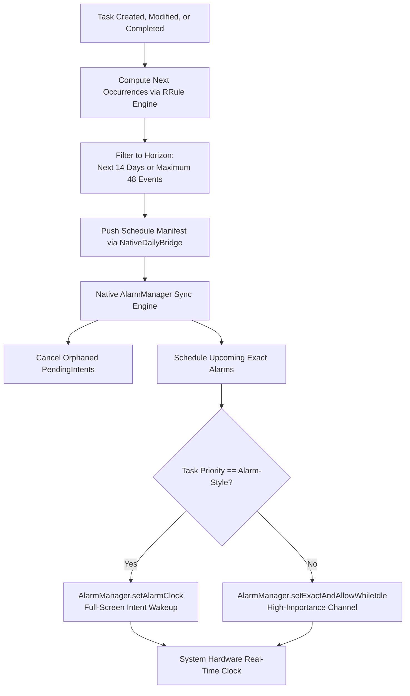

# Remember Me

A sovereign, local-first Android personal productivity and spatial awareness system built with Flutter, Riverpod, Isar Database, and native Kotlin services.

The system combines deterministic hardware-level alarm dispatch, natural language task decomposition, distraction mitigation via accessibility APIs, and battery-efficient dead-reckoning movement tracking with offline vector cartography. All data persistence is strictly local, with zero cloud dependencies, zero external telemetry, and no mandatory proprietary APIs.

---

## Table of Contents

- [System Architecture](#system-architecture)
  - [High-Level Component Topology](#high-level-component-topology)
  - [Headless Outbox Synchronization Sequence](#headless-outbox-synchronization-sequence)
  - [Movement Tracking and Filtering Pipeline](#movement-tracking-and-filtering-pipeline)
  - [Rolling Exact Alarm Dispatch Pipeline](#rolling-exact-alarm-dispatch-pipeline)
- [Core Subsystems](#core-subsystems)
  - [1. Temporal Planning and Natural Language Capture](#1-temporal-planning-and-natural-language-capture)
  - [2. Hardware-Reliable Alarm Scheduling](#2-hardware-reliable-alarm-scheduling)
  - [3. High-Precision Daily Trail and Offline Cartography](#3-high-precision-daily-trail-and-offline-cartography)
  - [4. Autonomous Geofencing and Place Linking](#4-autonomous-geofencing-and-place-linking)
  - [5. Focus Guard Subsystem](#5-focus-guard-subsystem)
- [Codebase Organization](#codebase-organization)
- [Security, Privacy, and Android Permissions](#security-privacy-and-android-permissions)
- [Build, Test, and Verification](#build-test-and-verification)
- [Binary Releases and Deployment](#binary-releases-and-deployment)
- [Architecture Decision Records (ADR)](#architecture-decision-records-adr)
- [License](#license)

---

## System Architecture

The Remember Me architecture implements a strict boundary separation between declarative UI presentation, reactive state management, repository-abstracted local persistence, and native Android operating system services.

### High-Level Component Topology



---

### Headless Outbox Synchronization Sequence

To avoid the memory and cold-start latency of booting the Dart VM for background notification quick-actions (such as marking a task as "Done" or triggering "Snooze 10m"), the system uses an atomic disk outbox pattern:



---

### Movement Tracking and Filtering Pipeline

Continuous movement tracking requires suppressing stationary GPS jitter, isolating loss-of-signal periods (such as transit tunnels), and preserving battery autonomy:



---

### Rolling Exact Alarm Dispatch Pipeline

To support infinite task recurrences without exhausting Android operating system alarm slots or degrading battery life, a rolling window reconciliation algorithm is enforced:



---

## Core Subsystems

### 1. Temporal Planning and Natural Language Capture

The planning subsystem provides continuous task scheduling across temporal boundaries:
- **Natural Language Parsing Engine (`natural_language_parser.dart`):** Tokenizes input strings to extract relative/absolute dates, times, repetition patterns, tags, and priority ranks in real time (e.g., `Review release notes tomorrow at 10:30am #release !high`).
- **Midnight Rollover:** Uncompleted items automatically roll forward into the active day view without data duplication or manual intervention.
- **Bi-directional Recurrence:** Supports RFC-compliant daily, weekly, monthly, and interval-based recurrence rules with historical completion isolation.

### 2. Hardware-Reliable Alarm Scheduling

Standard Flutter notification plugins suffer from timing drift during extended deep sleep states. Remember Me implements a bespoke native scheduler:
- **Exact Alarm API Integration:** Uses `AlarmManager.setAlarmClock` for mission-critical reminders and `setExactAndAllowWhileIdle` for standard time-bound reminders.
- **Doze Mode Bypass:** Direct integration with hardware RTC wake locks guarantees delivery regardless of device sleep depth or aggressive OEM battery optimization policies.
- **Versioned Audio Channels:** Employs immutable Android O+ channels (`reminders_v2`, `reminders_alarm_v2`, `place_alerts_v2`, `trail_status`) configured with strict audio attributes (`USAGE_ALARM`, `USAGE_NOTIFICATION`) to prevent silent notification degradation.
- **Headless Action Handling:** "Done" and "Snooze" actions are intercepted by a native broadcast receiver, updating system notification displays instantly and queueing database updates via an atomic disk outbox.

### 3. High-Precision Daily Trail and Offline Cartography

The spatial subsystem maintains historical movement context while minimizing CPU and battery consumption:
- **2D Metric Kalman Filter:** Raw latitude and longitude pairs are projected onto a local East-North-Up (ENU) Cartesian plane. A constant-velocity linear Kalman filter filters multipath reflection and suppresses drift when the user is stationary (<12m standard deviation).
- **Tunnel and Outage Isolation:** If signal loss exceeds 120 seconds or an implied teleportation velocity exceeds 180 km/h, the segment is isolated as a `TrailGap`, preventing erroneous straight-line interpolation across cities.
- **Polyline Decimation:** Ramer-Douglas-Peucker (RDP) algorithm (`epsilon = 2.0 meters`) reduces dense coordinate sets (10,000+ points) by 75–85%, maintaining fluid 60–120 FPS render performance on resource-constrained devices.
- **Dual Cartographic Stack:**
  - **OpenFreeMap Bright Vector Tiles:** Vector tiles rendered via MapLibre GL without third-party API keys, credit card requirements, or cloud subscription fees.
  - **Optional Google Maps Layer:** Drop-in native Google Maps SDK layer toggleable when a valid client key is provided.
- **Dual-Tier Cache:** In-memory L1 cache bounded to 64 tiles combined with an L2 persistent disk cache capped at 150MB with throttled directory scanning (prunes every 50 writes).

### 4. Autonomous Geofencing and Place Linking

Location-triggered reminders run autonomously without running constant GPS tracking:
- **Sliding Geofence Window:** When continuous GPS tracking is disabled, the system dynamically registers the 20 nearest saved locations via Google Play Services `GeofencingClient`. The center recalculates whenever the user moves further than 1,000 meters.
- **Dwell and Hysteresis Filters:** Requires a continuous 90-second dwell time before firing arrival triggers, combined with a `radius + 50m` exit threshold to prevent oscillation on geofence boundaries.
- **Headless Place Linking:** Place triggers query pending tasks associated with matching tags and display current task counts immediately without waking the Dart execution environment.

### 5. Focus Guard Subsystem

A distraction mitigation system designed to preserve uninterrupted attention:
- **Window Interception:** Utilizes an Android `AccessibilityService` to monitor top-window package changes and overlay an intentional blocking screen over distraction targets.
- **Safety Allowlist:** Core operating system utilities (Emergency Dialer, Settings, System Launcher) are hardcoded as non-blockable safety exceptions.
- **Crash Recovery:** Session timestamps are committed to disk upon initiation, enabling exact session duration recovery across power cycles or operating system task termination.

---

## Codebase Organization

```text
z7.Remember me-NIR/
├── android/                                   # Native Android Project
│   └── app/src/main/kotlin/com/example/remember_me/
│       ├── MainActivity.kt                    # Platform channel lifecycle & bridge dispatch
│       ├── AlarmReceiver.kt                   # Exact alarm receiver & sound pipeline
│       ├── TrackingService.kt                 # Foreground service with 2D Kalman GPS filter
│       ├── GeofenceReceiver.kt                # Hardware geofence transition broadcast receiver
│       ├── OutboxManager.kt                   # Disk-backed headless notification action queue
│       └── AccessibilityFocusService.kt       # System accessibility focus guard monitor
├── lib/
│   ├── main.dart                              # Application bootstrap & error boundary
│   └── src/
│       ├── app.dart                           # App root, orientation lock, palette theme engine
│       ├── core/
│       │   ├── bootstrap/bootstrap.dart       # Asynchronous database & service startup
│       │   ├── logging/app_logger.dart        # Ring-buffered in-memory and disk logger
│       │   ├── notifications/                 # Unified ReminderScheduler interface
│       │   ├── platform/                      # Typed NativeDailyBridge MethodChannels
│       │   ├── theme/daily_theme.dart         # Multi-palette system (Mint, Ocean, Rose)
│       │   └── utils/                         # NaturalLanguageParser, TrailDecimator, Date formatters
│       ├── data/
│       │   ├── local/isar_service.dart        # Isar database lifecycle & schema definitions
│       │   ├── models/                        # TaskModel, SavedPlaceModel, TrailFix, FocusSession
│       │   └── repositories/                  # Domain repositories behind abstract interfaces
│       ├── features/
│       │   ├── calendar/presentation/         # Date strip, monthly matrix, recurrence breakdown
│       │   ├── tasks/presentation/            # QuickAddBar, TaskRow, TaskEditorBottomSheet
│       │   ├── today/presentation/            # Today dashboard, completion metrics, task views
│       │   └── splash/presentation/           # EntranceReveal fluid physics animation
│       └── presentation/
│           ├── providers/daily_providers.dart # Riverpod state providers and controllers
│           └── screens/                       # DailyHomeScreen, DailyFocusScreen, DailyTrailScreen
├── test/                                      # Unit, widget, and state test suites (57+ tests)
├── docs/
│   ├── AUDIT.md                               # Architectural audit & root-cause analyses
│   ├── API_SETUP.md                           # Cartography and API configuration documentation
│   └── adr/                                   # Architecture Decision Records (001 through 008)
└── pubspec.yaml                               # Flutter dependencies and compilation constraints
```

---

## Security, Privacy, and Android Permissions

Remember Me adheres to a strict principle of least privilege and zero data exfiltration:

| Android Permission | Declaration Level | Operational Justification | Privacy Guarantee |
| :--- | :--- | :--- | :--- |
| `POST_NOTIFICATIONS` | Runtime (API 33+) | Emits critical reminders and place notifications. | Strictly local; no promotional or tracking notifications. |
| `SCHEDULE_EXACT_ALARM` | System / Special | Configures hardware RTC wakeups for user tasks. | Controlled within a finite 14-day rolling window. |
| `ACCESS_FINE_LOCATION` | Runtime | Feeds the 2D Kalman filter during trail recording. | Stored strictly in local database; never transmitted off-device. |
| `ACCESS_BACKGROUND_LOCATION` | Runtime | Evaluates hardware geofences while application is closed. | Evaluated locally by system Google Play Services daemon. |
| `FOREGROUND_SERVICE_LOCATION` | Manifest / System | Keeps movement tracking thread alive during transit. | Explicit status notification visible at all times while active. |
| `ACCESSIBILITY_SERVICE` | Explicit Settings | Inspects foreground package names during Focus Mode. | Inspects only window package identifiers; zero text or screen capture. |

---

## Build, Test, and Verification

### Prerequisites
- **Flutter SDK:** Version `3.24.x` or higher
- **Dart SDK:** Version `3.5.x` or higher
- **Android SDK:** Compile SDK 35, Min SDK 26, Target SDK 35
- **Java Development Kit:** OpenJDK 17
- **Gradle:** Version 8.14 (bundled via Gradle Wrapper)

### Verification Pipeline
The codebase enforces a zero-warning quality gate across both Dart and Kotlin layers.

```powershell
# 1. Resolve Dart and Flutter dependencies
flutter pub get

# 2. Execute strict static analysis (0 issues required)
flutter analyze

# 3. Execute Flutter unit and widget test suite (57 passing tests)
flutter test

# 4. Execute Native Android JVM unit tests
cd android
.\gradlew.bat :app:testDebugUnitTest
cd ..
```

---

## Binary Releases and Deployment

Production release builds are compiled with full R8 code optimization, resource shrinking, and dead-code stripping:

### Build Universal Release Package
```powershell
flutter build apk --release --tree-shake-icons
```
Output path:
```text
build/app/outputs/flutter-apk/app-release.apk
```

### Direct Download
- [**Download Remember-Me.apk (Latest Release)**](https://github.com/sharancode3/Remember-Me---Personal-Reminder-To-do-/releases/latest/download/Remember-Me.apk)
- [**Download Remember-Me.apk (v1.0.2)**](https://github.com/sharancode3/Remember-Me---Personal-Reminder-To-do-/releases/download/v1.0.2/Remember-Me.apk)
- [**View Release on GitHub**](https://github.com/sharancode3/Remember-Me---Personal-Reminder-To-do-/releases/tag/v1.0.2)

---

## Architecture Decision Records (ADR)

All design choices, trade-offs, and technical pivots are documented within the repository:

| Identifier | Document | Topic | Context & Rationale |
| :--- | :--- | :--- | :--- |
| **ADR 001** | [`001-architecture-pruning.md`](docs/adr/001-architecture-pruning.md) | Codebase Pruning | Pruned dormant Architecture A engines and consolidated on Architecture B Daily App. |
| **ADR 002** | [`002-persistence-strategy.md`](docs/adr/002-persistence-strategy.md) | Persistence Layer | Isolated Isar 3.x behind clean repository interfaces for future migration readiness. |
| **ADR 003a** | [`003-notification-scheduler-outbox.md`](docs/adr/003-notification-scheduler-outbox.md) | Outbox Pattern | Unified alarm scheduling on native Kotlin and implemented atomic headless disk outbox. |
| **ADR 003b** | [`003-trail-kalman-gaps.md`](docs/adr/003-trail-kalman-gaps.md) | Movement Tracking | Deployed local ENU 2D Kalman filter, stationary drift clamp, and explicit gap detection. |
| **ADR 004** | [`004-native-geofencing-places.md`](docs/adr/004-native-geofencing-places.md) | Geofencing Engine | Constructed 20-geofence sliding window with 90s dwell and hysteresis boundary filters. |
| **ADR 005** | [`005-map-stack.md`](docs/adr/005-map-stack.md) | Vector Cartography | Standardized on MapLibre GL with OpenFreeMap Bright vector tiles and optional Google Maps view. |
| **ADR 006** | [`006-feature-architecture.md`](docs/adr/006-feature-architecture.md) | Feature Packaging | Modularized codebase into feature boundaries with typed compile-time platform bridges. |
| **ADR 007** | [`007-performance-ci.md`](docs/adr/007-performance-ci.md) | Rendering Performance | Integrated RDP polyline decimation and bounded dual-tier LRU tile cache. |
| **ADR 008** | [`008-final-polish.md`](docs/adr/008-final-polish.md) | UI Polish & Release | Finalized physics-based fluid entrance reveal, orientation locks, and production sign-off. |
| **ADR 009** | [`009-codebase-restructuring-hardening.md`](docs/adr/009-codebase-restructuring-hardening.md) | Canonical Barrels & Hardening | Standardized module barrel exports, enforced flow control blocks, and version bump. |

---

## License

Remember Me is licensed under the [MIT License](LICENSE).
All derivative works must preserve copyright and license notices.
